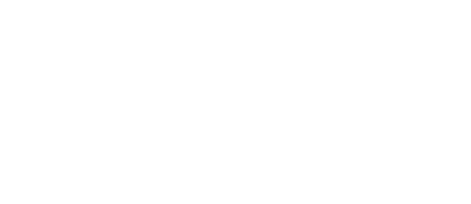

# HID-API
.NET library leveraging Man-in-the-middle (MITM) for seamless mouse & keyboard passthrough, while allowing for data interception and injection to an external computer.

<p align="center">
    
</p>

Icons from [icons8](https://icons8.com/).

## Pi setup
Assuming your using a Rpi 4b, Zero, or newer Rpi 5
1. dwc2, libcomposite modules must be loaded on your pi you can follow this [guide "Step 1", "Step 2", "Step 3"](https://www.isticktoit.net/?p=1383) (_ignore the update step_).
2. Create a custom gadget _"config script"_, here's an [working example](./examples/custom_gadget.sh) using the compatible report descriptor.
```shell
sudo nano /usr/bin/custom_gadget.sh
sudo chmod +x /usr/bin/custom_gadget.sh
```
3. Next, you'll need it to auto run to init the gadget on boot or login e.g. rc.local
```shell
sudo nano /etc/rc.local/
```
Place the following above ``exit 0`` inside rc.local:
``/usr/bin/custom_gadget``

4. Now either restart or run ``sudo /usr/bin/custom_gadget.sh``, and it should initialize hidg0, and hidg1 in ``/dev/`` (Example Script).

## Setup on other Linux devices (Unsupported, _your mileage may vary_)
- dwc2 must be in [salve](https://en.wikipedia.org/wiki/Master/slave_(technology)) / peripheral mode.
- GadgetFs module loaded _``modprobe gadgetfs``_

## Examples
Start handling inputs from ``/dev/input/mice`` (mouse device path) and output them to ``/dev/hidg0`` (**_the external computer_**)
```c#
var hidThread = new Thread(() => hidHandler = new HidHandler(new[]
    {
        "/dev/input/mice"
    },
    null!, 
    "/dev/hidg0")
)
{
    IsBackground = true
};
hidThread.Start();
```

### Extract state from device (Mouse)
Grabs the current state from mouse 0 (*_/dev/input/mice_*), HidMouseHandlers is just a list make sure it's not empty. 
```c#
var mouseState = hidHandler.HidMouseHandlers[0].GetMouseState();
bool left = mouseState.LeftButton;
bool right = mouseState.RightButton;
```

### Injecting mouse events through the stream
Moves the mouse down 5 while maintaining left & right button state.
```c#
var hidStream = hidHandler.CreateHidStream("/dev/hidg1");
var mouseState = hidHandler.HidMouseHandlers[0].GetMouseState();

hidHandler.WriteMouseReport(mouseState with
{
    X = 0,
    Y = 5,
    Wheel = 0
}, hidStream);
```
When injecting mouse events or keyboard events use ``/dev/hidg1``. While you can use ``/dev/hidg0`` it is disincentived as it can cause slowdowns or outright crashing if the device file becomes overused. 

## Using with different devices
By default the first mouse you connect should default all output into the legacy ``/dev/input/mice`` virtual device file.
However if it does not you'll have to find it in ``/dev/input/by-path/...mouse``.

if want to add more devices such as keyboard it'll also be in ``/dev/input/by-path/...``.

```c#
var hidThread = new Thread(() => hidHandler = new HidHandler(new[]
    {
        "/dev/input/mice"
    },
    new[] {"/dev/input/by-id/usb-Logitech_G502_HERO_Gaming_Mouse_D86730BE8888-if01-event-kbd"}, 
    "/dev/hidg0")
)
{
    IsBackground = true
};
hidThread.Start();
```
This adds support for key macros on my real g502 mouse however this will vary based on your mouse. 

## Features
- Hot reloading devices
- Multithreading safe
- Basic

## Report descriptor used by this library
Parsed output from [eleccelerator](https://eleccelerator.com/usbdescreqparser).
```
0x05, 0x01,        // Usage Page (Generic Desktop Ctrls)
0x09, 0x02,        // Usage (Mouse)
0xA1, 0x01,        // Collection (Application)
0x09, 0x01,        //   Usage (Pointer)
0xA1, 0x00,        //   Collection (Physical)
0x85, 0x01,        //     Report ID (1)
0x05, 0x09,        //     Usage Page (Button)
0x19, 0x01,        //     Usage Minimum (0x01)
0x29, 0x05,        //     Usage Maximum (0x05)
0x15, 0x00,        //     Logical Minimum (0)
0x25, 0x01,        //     Logical Maximum (1)
0x95, 0x05,        //     Report Count (5)
0x75, 0x01,        //     Report Size (1)
0x81, 0x02,        //     Input (Data,Var,Abs,No Wrap,Linear,Preferred State,No Null Position)
0x95, 0x01,        //     Report Count (1)
0x75, 0x03,        //     Report Size (3)
0x81, 0x03,        //     Input (Const,Var,Abs,No Wrap,Linear,Preferred State,No Null Position)
0x05, 0x01,        //     Usage Page (Generic Desktop Ctrls)
0x09, 0x30,        //     Usage (X)
0x09, 0x31,        //     Usage (Y)
0x16, 0x01, 0x80,  //     Logical Minimum (-32767)
0x26, 0xFF, 0x7F,  //     Logical Maximum (32767)
0x75, 0x10,        //     Report Size (16)
0x95, 0x02,        //     Report Count (2)
0x81, 0x06,        //     Input (Data,Var,Rel,No Wrap,Linear,Preferred State,No Null Position)
0x09, 0x38,        //     Usage (Wheel)
0x15, 0x81,        //     Logical Minimum (-127)
0x25, 0x7F,        //     Logical Maximum (127)
0x75, 0x08,        //     Report Size (8)
0x95, 0x01,        //     Report Count (1)
0x81, 0x06,        //     Input (Data,Var,Rel,No Wrap,Linear,Preferred State,No Null Position)
0xC0,              //   End Collection
0xC0,              // End Collection
0x05, 0x01,        // Usage Page (Generic Desktop Ctrls)
0x09, 0x06,        // Usage (Keyboard)
0xA1, 0x01,        // Collection (Application)
0x85, 0x02,        //   Report ID (2)
0x05, 0x07,        //   Usage Page (Kbrd/Keypad)
0x19, 0xE0,        //   Usage Minimum (0xE0)
0x29, 0xE7,        //   Usage Maximum (0xE7)
0x15, 0x00,        //   Logical Minimum (0)
0x25, 0x01,        //   Logical Maximum (1)
0x75, 0x01,        //   Report Size (1)
0x95, 0x08,        //   Report Count (8)
0x81, 0x02,        //   Input (Data,Var,Abs,No Wrap,Linear,Preferred State,No Null Position)
0x75, 0x08,        //   Report Size (8)
0x95, 0x01,        //   Report Count (1)
0x81, 0x01,        //   Input (Const,Array,Abs,No Wrap,Linear,Preferred State,No Null Position)
0x75, 0x01,        //   Report Size (1)
0x95, 0x03,        //   Report Count (3)
0x05, 0x08,        //   Usage Page (LEDs)
0x19, 0x01,        //   Usage Minimum (Num Lock)
0x29, 0x03,        //   Usage Maximum (Scroll Lock)
0x91, 0x02,        //   Output (Data,Var,Abs,No Wrap,Linear,Preferred State,No Null Position,Non-volatile)
0x75, 0x01,        //   Report Size (1)
0x95, 0x05,        //   Report Count (5)
0x91, 0x01,        //   Output (Const,Array,Abs,No Wrap,Linear,Preferred State,No Null Position,Non-volatile)
0x75, 0x08,        //   Report Size (8)
0x95, 0x06,        //   Report Count (6)
0x15, 0x00,        //   Logical Minimum (0)
0x26, 0xFF, 0x00,  //   Logical Maximum (255)
0x05, 0x07,        //   Usage Page (Kbrd/Keypad)
0x19, 0x00,        //   Usage Minimum (0x00)
0x2A, 0xFF, 0x00,  //   Usage Maximum (0xFF)
0x81, 0x00,        //   Input (Data,Array,Abs,No Wrap,Linear,Preferred State,No Null Position)
0xC0,              // End Collection

// 133 bytes
```

### HEX
```
0x05 0x01 0x09 0x02 0xA1 0x01 0x09 0x01 0xA1 0x00 0x85 0x01 0x05 0x09 0x19 0x01 0x29 0x03 0x15 0x00 0x25 0x01 0x95 0x03 0x75 0x01 0x81 0x02 0x95 0x01 0x75 0x05 0x81 0x03 0x05 0x01 0x09 0x30 0x09 0x31 0x16 0x01 0x80 0x26 0xFF 0x7F 0x75 0x10 0x95 0x02 0x81 0x06 0x09 0x38 0x15 0x81 0x25 0x7F 0x75 0x08 0x95 0x01 0x81 0x06 0xC0 0xC0 0x05 0x01 0x09 0x06 0xA1 0x01 0x85 0x02 0x05 0x07 0x19 0xe0 0x29 0xe7 0x15 0x00 0x25 0x01 0x75 0x01 0x95 0x08 0x81 0x02 0x75 0x08 0x95 0x01 0x81 0x01 0x75 0x01 0x95 0x03 0x05 0x08 0x19 0x01 0x29 0x03 0x91 0x02 0x75 0x01 0x95 0x05 0x91 0x01 0x75 0x08 0x95 0x06 0x15 0x00 0x26 0xff 0x00 0x05 0x07 0x19 0x00 0x2a 0xff 0x00 0x81 0x00 
```